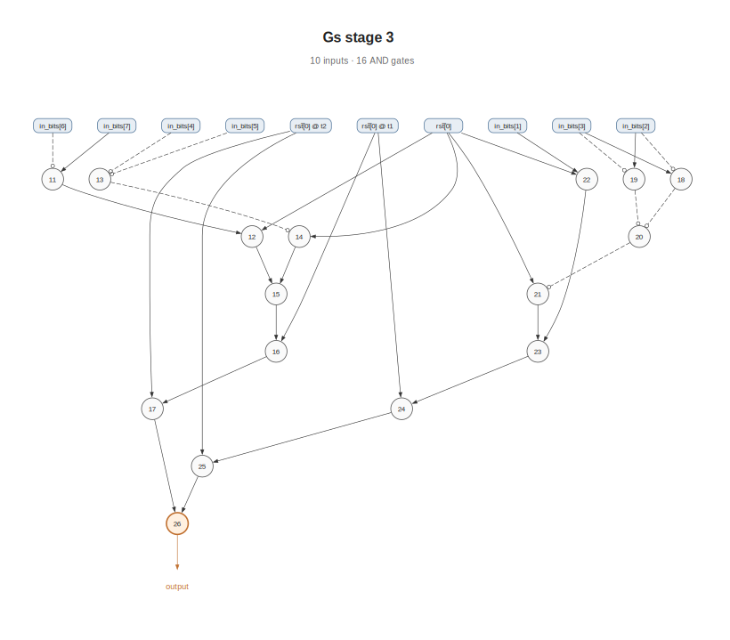
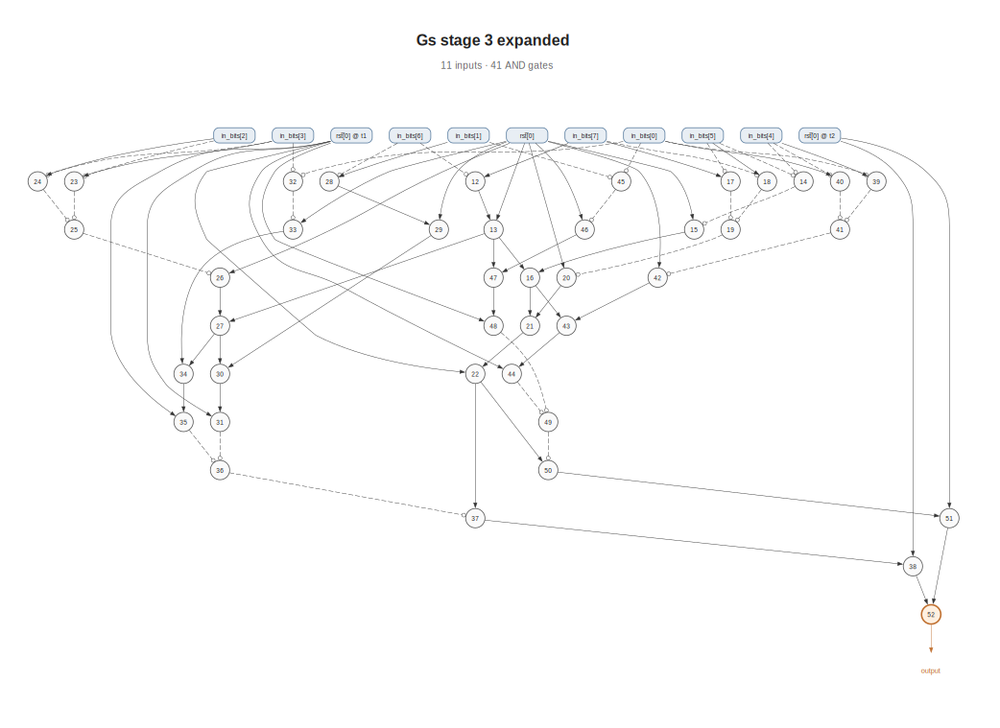
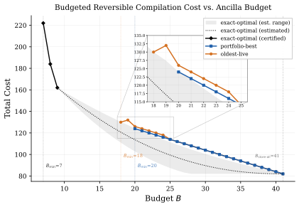
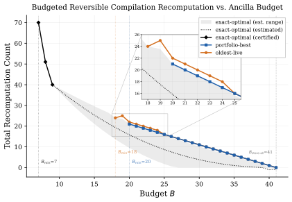

# Budgeted Reversible Computation on And-Inverter Graphs

This project investigates scheduling strategies for reversible computation on
And-Inverter Graphs (AIGs) under a strict ancilla budget constraint. The core
problem: evaluate the root of an AIG while keeping the number of simultaneously
live intermediate values at or below a given budget *B*, minimising total cost
from recomputations.

Five scheduling algorithms are implemented and compared, from a trivial
store-all baseline to a provably optimal Dijkstra-based search over the full
configuration graph.

---

## Table of Contents

- [Problem Statement](#problem-statement)
- [And-Inverter Graphs](#and-inverter-graphs)
- [Scheduling Model](#scheduling-model)
- [Algorithms](#algorithms)
  - [Store-All Scheduler](#store-all-scheduler)
  - [Budgeted Scheduler Framework](#budgeted-scheduler-framework)
  - [Eviction Policies](#eviction-policies)
  - [Portfolio Scheduler](#portfolio-scheduler)
  - [Exact-Optimal Scheduler](#exact-optimal-scheduler)
- [Experimental Results](#experimental-results)
- [Project Structure](#project-structure)
- [Building](#building)
- [Running](#running)
- [Plotting](#plotting)

---

## Problem Statement

Given a combinational circuit represented as a DAG of two-input AND gates (an
AIG), we want to evaluate the root output. In the reversible computing setting,
every intermediate gate value occupies one unit of **ancilla** storage, and
ancillae must be explicitly freed by **uncomputing** the value (running the gate
in reverse). A gate can only be uncomputed when both of its inputs are still
available.

The **active volume** at any point during execution is the number of
simultaneously live intermediate values. We impose a hard budget constraint *B*
on the active volume. When *B* < *N* (where *N* is the number of AND gates),
the scheduler must selectively evict and later recompute intermediate values to
stay within budget.

The optimisation objective is to minimise total cost while respecting the
budget, where cost is proportional to the number of (re)computation steps.

---

## And-Inverter Graphs

An AIG is a directed acyclic graph where:

- **Primary inputs** are the leaves (available for free, never consumed).
- **AND gates** are the internal nodes. Each gate takes two input literals and
  produces one output literal.
- A **literal** is a reference to a gate output, optionally negated (inverted).
  Under AIGER encoding: `literal = (node_id << 1) | invert_bit`.
- **Constants**: literal 0 = false, literal 1 = true.
- The **root literal** designates the final output of the predicate.

Negation is free (just a wire annotation), so only the AND gates contribute to
computation cost.

Two test predicates are evaluated, both derived from a hardware verification
condition (stage-3 flag pair of a ground-state predicate):

### Predicate 1 &mdash; `Gs_stage_3`

| Property | Value |
|:---|:---|
| Inputs | 10 (`rst_n[0]` at times 0/1/2, `in_bits[1..7]` at time 0) |
| AND gates | 16 (node IDs 11&ndash;26) |
| Root literal | 52 (node 26, positive) |

With only 16 gates, the exact-optimal scheduler solves all budgets 5 through 16.

  

### Predicate 2 &mdash; `Gs_stage_3_expanded`

| Property | Value |
|:---|:---|
| Inputs | 11 (`rst_n[0]` at times 0/1/2, `in_bits[0..7]` at time 0) |
| AND gates | 41 (node IDs 12&ndash;52) |
| Root literal | 104 (node 52, positive) |

At 41 gates the exact-optimal solver's state space grows exponentially with
budget, making it solvable only for small budgets (B = 7, 8, 9 certified so
far). This is the main experimental benchmark.

  

**Reading the diagrams:** Blue boxes are primary inputs. Light circles are AND
gates (labelled by node ID). The orange-bordered circle is the root gate.
Solid edges carry positive (non-inverted) signals. Dashed edges with open
circles at the arrowhead carry negated signals.

---

## Scheduling Model

A **schedule** is a sequence of operations that starts with an empty live set,
evaluates the root, and returns to an empty live set.

### Operations

| Operation | Precondition | Effect | Cost |
|:---|:---|:---|:---|
| Compute(*v*) | Both fanins of *v* available; *v* not live | Adds *v* to live set | 1 |
| Uncompute(*v*) | *v* is live; both fanins of *v* available | Removes *v* from live set | 1 |
| UseRoot | Root node is live; called exactly once | &mdash; | 0 |

"Available" means a fanin is either a primary input (always available), a
constant, or an internal node currently in the live set.

The key constraint on Uncompute is that a gate can only be uncomputed when both
its inputs are still live. This mirrors the reversibility requirement: running
the AND gate backwards needs access to both input values.

### Budget Constraint

At every point during the schedule, the number of live intermediates must not
exceed the budget:

> |live set| &le; *B*

When the live set is full and a new gate needs to be computed, some existing
gate must first be evicted (uncomputed).

### Cost Model

Under the unit-cost model:

> total\_cost = 2 &times; &Sigma;v compute\_count(*v*)

Each compute and each uncompute costs 1 unit. Since every computed gate is
eventually uncomputed exactly once, the factor of 2 accounts for the
compute/uncompute pair. A gate computed *k* times contributes *k* &minus; 1
recomputations.

The **store-all cost** (*B* = *N*, zero recomputations) equals 2*N*, which is
the theoretical minimum. Any schedule with *B* < *N* will have total cost >
2*N* due to recomputation overhead.

### Schedule Legality

A schedule is **feasible** if:

1. The active volume never exceeds *B*.
2. The root is successfully evaluated (UseRoot is reached).
3. The live set is empty at the end (all values are cleaned up).

A schedule is **infeasible** if the scheduler cannot find any legal sequence of
operations satisfying all constraints for the given budget.

---

## Algorithms

### Store-All Scheduler

The simplest possible strategy. With budget *B* = *N*:

1. **Forward pass:** Compute every gate exactly once in topological order.
2. **UseRoot:** Consume the root output.
3. **Backward pass:** Uncompute every gate in reverse topological order.

This achieves the minimum possible cost of 2*N* with zero recomputations. It
serves as the baseline: when *B* &ge; *N*, every other algorithm should match
this cost.

### Budgeted Scheduler Framework

All heuristic schedulers share a common framework (`BudgetedScheduler`) that
implements the core budget-constrained scheduling loop. The framework is
parameterised by an **eviction policy** that decides which node to evict when
the live set is full.

The schedule proceeds in three phases:

1. **Build up:** Materialise the root node by calling `ensure_live(root)`.
2. **Use root:** Record the UseRoot action.
3. **Cleanup:** Uncompute all remaining live nodes, re-materialising missing
   fanins as needed.

#### The `ensure_live` function

This is the heart of the budgeted scheduler. To ensure node *v* is live:

1. If *v* is already live, return immediately.
2. Recursively ensure each internal fanin of *v* is live.
3. While |live set| &ge; *B*, invoke the eviction policy to select a victim
   and uncompute it.
4. Compute *v*.

Each recursion level maintains a **protected set** of nodes that must not be
evicted (the current target, its fanins, and anything the caller needs). This
prevents the scheduler from evicting a node that is about to be used.

#### Two-phase eviction

When the live set is full, the scheduler uses a two-phase eviction strategy:

1. **Phase 1 (strand-safe):** Ask the eviction policy for a victim. Before
   accepting, check whether uncomputing this victim would **strand** another
   live node (i.e., destroy one of its fanins, making it impossible to later
   uncompute). If the victim would strand something, exclude it and try the
   next candidate.

2. **Phase 2 (fallback):** If no strand-safe candidate exists, accept the
   policy's original choice. Creating a zombie (stranded node) is preferable
   to declaring infeasible prematurely. Fallback evictions are counted in the
   metrics.

### Eviction Policies

Each eviction policy implements one strategy for choosing which live node to
evict when room is needed. All policies share the same interface:

- Consider only nodes that are (a) currently live, (b) not in the protected
  set, and (c) legally uncomputable (both fanins available).
- Return the single best victim according to the policy's criterion.
- Deterministic tie-breaking: smallest node ID wins.

#### Oldest-live

**Criterion:** Evict the node with the smallest `live_since_step` timestamp.

The node that has been live the longest is least likely to be needed in the near
future (temporal locality heuristic). Analogous to a FIFO replacement policy.
Simple and effective for graphs with sequential structure, but ignores the DAG
topology entirely.

#### Smallest-fanout

**Criterion:** Evict the node with the fewest downstream dependents (smallest
fanout count in the DAG).

A node with fewer downstream dependents is less likely to be needed again,
because fewer future computations depend on it. Fanout counts are precomputed
once during DAG analysis. Structure-aware, but does not account for depth (how
expensive it is to rebuild) or how many times the node has already been
recomputed.

#### Depth-aware

**Criterion:** Evict the node with the smallest structural depth.

Depth measures the longest path from any primary input to the node. A shallow
node (small depth) is close to the inputs and cheap to rebuild, since few
intermediate nodes need to be re-materialised. Depth is precomputed in
topological order: inputs have depth 0, each AND node's depth is
1 + max(depth of left fanin, depth of right fanin). Does not consider how many
downstream nodes depend on the evicted node.

#### Recompute-aware

**Criterion:** Evict the node with the smallest recomputation pain score:

> score(*v*) = depth(*v*) &times; fanout(*v*) &times; (1 + compute\_count(*v*))

This multiplicative score combines three dimensions:

| Factor | What it captures |
|:---|:---|
| depth(*v*) | How expensive it is to rebuild *v* from inputs |
| fanout(*v*) | How many downstream nodes depend on *v* |
| 1 + compute\_count(*v*) | How "hot" *v* is (frequently recomputed nodes are likely needed again) |

A lower score means the node is cheaper to evict. If any factor is zero (e.g.,
a depth-0 node or a fanout-0 node), the score collapses to zero, making that
node maximally cheap to evict. This is the most informed single heuristic,
combining structural and runtime information.

### Portfolio Scheduler

Rather than committing to a single eviction policy, the portfolio scheduler
runs all three structural policies independently on the same DAG and budget,
then selects the best result.

**Portfolio members:**

1. Smallest-fanout policy
2. Depth-aware policy
3. Recompute-aware policy

**Selection rule (deterministic tie-breaking cascade):**

1. Discard infeasible results.
2. Select the schedule with the lowest total cost.
3. Break ties by lowest peak active volume.
4. Break ties by lowest total recomputations.
5. Break ties by policy priority order (smallest-fanout > depth-aware >
   recompute-aware).

If all three policies produce infeasible schedules, the portfolio result is
infeasible. The portfolio result is always at least as good as the best
individual policy, at the cost of running three independent schedules.

### Exact-Optimal Scheduler

The exact-optimal scheduler finds a provably minimum-cost schedule by exhaustive
search. It models the scheduling problem as a shortest-path problem on a
**configuration graph** and solves it with Dijkstra's algorithm.

#### Configuration graph

Each state encodes:

- The current **live set** (which gates are currently stored), represented as a
  bitmask over the *N* gates.
- Whether the **root has been used** (a single boolean flag).

These are packed into a single `uint64_t`: bits 0..62 hold the live-set mask,
bit 63 holds the root-used flag. This supports up to 63 internal nodes.

| | |
|:---|:---|
| **Start state** | live set = empty, root\_used = false |
| **Goal state** | live set = empty, root\_used = true |

#### Transitions

From each state, three types of transitions are considered:

| Transition | Precondition | Cost | Effect |
|:---|:---|:---|:---|
| Compute(*v*) | *v* not live; fanins available; \|live\| + 1 &le; *B* | 1 | Sets bit *v* |
| Uncompute(*v*) | *v* live; fanins available | 1 | Clears bit *v* |
| UseRoot | Root live; root not yet used | 0 | Sets root\_used flag |

#### Search

Dijkstra's algorithm with a min-heap priority queue. Because all edge weights
are non-negative (0 or 1), Dijkstra guarantees the first path found to the goal
state is optimal. The algorithm maintains a distance map and predecessor map for
path reconstruction.

#### Compact node indexing

Since DAG node IDs may not be contiguous (e.g., nodes 12..52 for predicate 2),
the scheduler builds a compact index mapping each node ID to a consecutive bit
position 0..*N*&minus;1. Fanin relationships are precomputed as bitmasks for
fast availability checks.

#### State limit

The configuration graph has up to 2*N*+1 reachable states. For
predicate 2 (*N* = 41), this is astronomically large. The solver imposes a
configurable state limit (currently 500 million explored states). If the limit
is reached before finding the goal, the result is reported as infeasible with
the number of states explored.

**Certified results for predicate 2:**

| Budget | Total Cost | Recomputations | States Explored |
|:---|:---|:---|:---|
| B = 7 | 222 | 70 | 27.5 million |
| B = 8 | 184 | 51 | 199 million |
| B = 9 | 162 | 40 | 995 million |

The state space grows roughly 7&ndash;8&times; per additional unit of budget.
B = 10 and beyond are currently intractable within the 1-billion-state limit.

#### The B &ge; N shortcut

When the budget is at least *N*, the store-all schedule is provably optimal. The
exact solver recognises this and returns the store-all result directly without
running the search.

---

## Experimental Results

### Predicate 1 (16 gates)

The exact-optimal solver runs in under a second for all budgets. The portfolio
heuristic matches exact-optimal cost at every budget from B = 8 onward, with the
smallest-fanout policy always selected as the winner.

| Budget | Exact-Optimal Cost | Portfolio Cost | Oldest-Live Cost |
|:---|:---|:---|:---|
| 5 | 58 | &mdash; | &mdash; |
| 6 | 52 | &mdash; | &mdash; |
| 7 | 50 | &mdash; | &mdash; |
| 8 | 48 | 48 | 48 |
| 9 | 46 | 46 | 46 |
| 10 | 44 | 44 | 44 |
| 11 | 42 | 42 | 42 |
| 12 | 40 | 40 | 40 |
| 13 | 38 | 38 | 38 |
| 14 | 36 | 36 | 36 |
| 15 | 34 | 34 | 34 |
| 16 | 32 | 32 | 32 |

Both heuristics become feasible at B = 8 and match exact-optimal cost at every
budget. The portfolio heuristic is provably optimal for this predicate.

### Predicate 2 (41 gates)

This is the main benchmark. The heuristics become feasible at much higher
budgets than exact-optimal:

| Scheduler | First Feasible Budget |
|:---|:---|
| Exact-optimal | B = 7 |
| Oldest-live | B = 18 |
| Portfolio-best | B = 20 |

The heuristic gap is significant: the exact solver certifies feasible schedules
at B = 7 (cost 222), B = 8 (cost 184), and B = 9 (cost 162), while the
heuristics require 2&ndash;3&times; more budget to even become feasible.

Once the heuristic methods become feasible, portfolio-best is never worse than
the oldest-live baseline. As *B* increases, all methods converge toward the
store-all endpoint at B = 41 (cost 82, zero recomputations).

  

  

Black diamonds denote certified exact-optimal points (B = 7, 8, 9). The dotted
black curve and gray ribbon show an estimated exact trend over unresolved
budgets. The inset zooms into the tight-budget region where the heuristic gap
between portfolio-best (blue) and oldest-live (orange) is most visible.